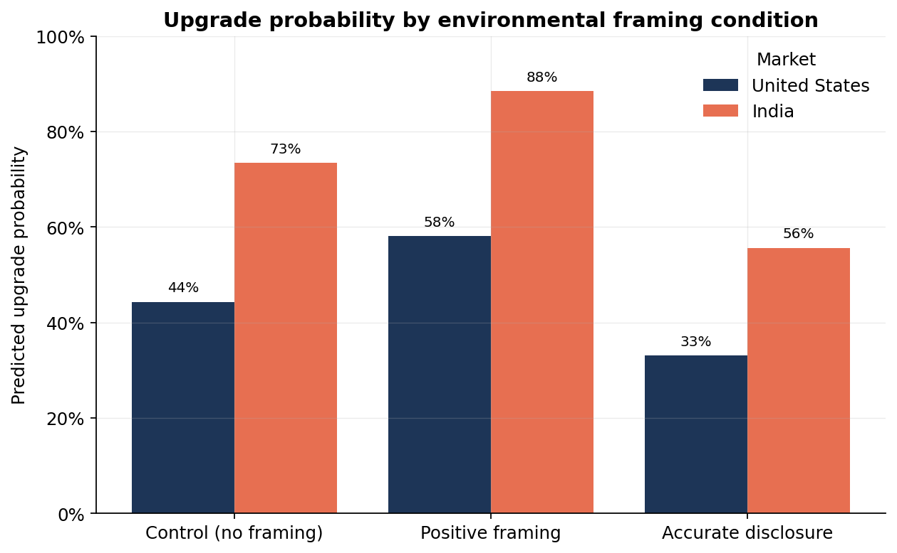
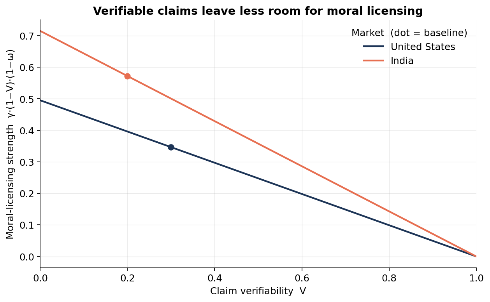
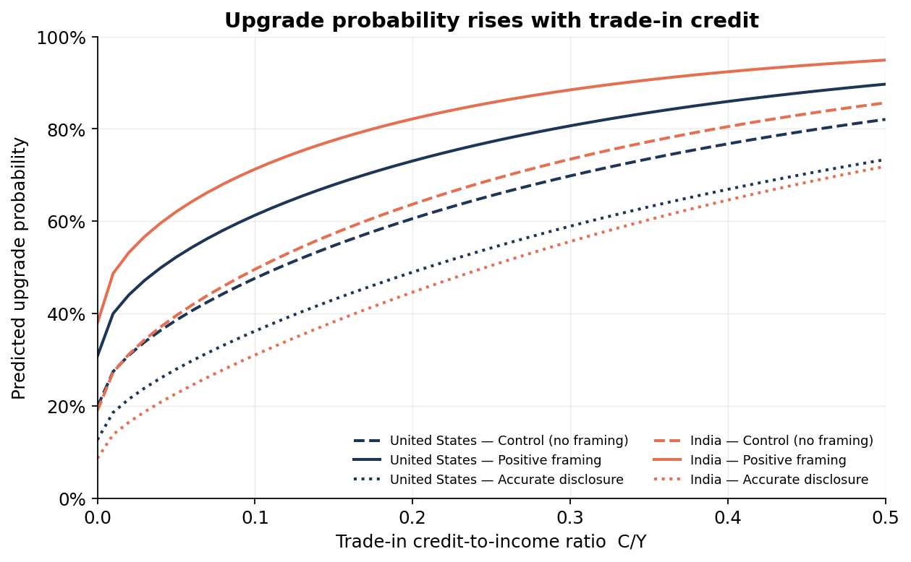
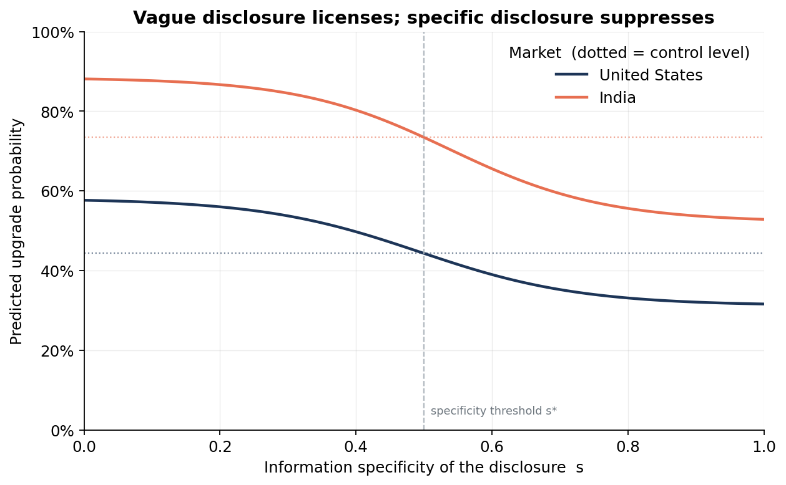

# 📱 Smartphone Upgrade Probability Model

A Python behavioral-economics simulation of how environmental trade-in framing may influence
smartphone **upgrade probability** through **moral licensing**, compared across the
**United States** and **India**.

> **The core idea.** Manufacturers often frame trade-in programs as *environmentally
> responsible*. This model formalizes the argument that such positive framing may **not**
> reduce upgrades — instead it can *morally license* consumers to upgrade sooner by signalling
> that the environmental cost has already been handled. Accurate, specific disclosure does the
> opposite.

> ⚠️ **This is a theoretical simulation, not an empirical study.** The parameters are stylized
> and are meant to generate *testable predictions*, not to forecast real consumer behavior. See
> [Limitations](#limitations).

---

## The result in one chart

Positive "green" framing **raises** predicted upgrade probability; accurate, specific
disclosure **lowers** it below the no-framing baseline — in both markets.



| Market | Control | Positive framing | Accurate disclosure | Licensing gap |
|---|---:|---:|---:|---:|
| United States | 44.3% | 58.1% | 33.1% | **+13.7%** |
| India | 73.4% | 88.5% | 55.6% | **+15.0%** |

---

## The model

$$
P(\text{upgrade}\mid f) = \Phi\!\Big[\, v(C/Y) \;-\; \delta\,\kappa \;+\; \gamma\,\phi(f)\,(1-V)\,(1-\omega) \,\Big]
$$

| Symbol | Meaning |
|---|---|
| $C/Y$ | trade-in credit-to-income ratio |
| $v(C/Y)$ | concave utility from the trade-in credit (scaled by present bias $\beta$) |
| $\kappa$ | baseline resistance to upgrading (weighted by discount factor $\delta$) |
| $\gamma$ | moral-licensing effect size |
| $\phi(f)$ | framing-condition effect: $0$ (control), $+1$ (positive), or a logistic of disclosure specificity for accurate disclosure |
| $V$ | claim verifiability — verifiable claims leave *less* room to license |
| $\omega$ | environmental self-identity — a strong identity *resists* licensing |
| $\Phi$ | standard normal CDF |

The **moral-licensing term** $\gamma\,\phi(f)\,(1-V)\,(1-\omega)$ is the heart of the story.
Positive framing sets $\phi=+1$ and pushes the latent score up; accurate, *specific* disclosure
flips $\phi$ negative and pushes it down.

---

## Quickstart

```bash
git clone <your-repo-url>
cd upgrade_probability_model_repo
pip install -r requirements.txt

# 1) One-line baseline simulation (no dependencies beyond the standard library):
python model.py

# 2) Regenerate all figures into ./figures:
python figures.py

# 3) Open the full walkthrough notebook:
jupyter notebook notebooks/upgrade_probability_model.ipynb

# 4) (Optional) launch the interactive dashboard:
streamlit run app.py
```

The **core model (`model.py`) depends only on the Python standard library** — `math.erf` gives
us the normal CDF — so it imports and runs anywhere. `pandas` / `matplotlib` are only needed for
the notebook and charts; `streamlit` only for the app.

---

## What's inside

| File | What it does |
|---|---|
| [`model.py`](model.py) | The simulation engine: trade-in utility, framing term, latent score, upgrade probability, moral-licensing strength, and a CSV loader. Pure standard library. |
| [`figures.py`](figures.py) | Builds the five charts; importable so the notebook reuses them. |
| [`app.py`](app.py) | Streamlit dashboard with sliders for every parameter. |
| [`data/parameters.csv`](data/parameters.csv) | Baseline behavioral parameters per market. |
| [`notebooks/upgrade_probability_model.ipynb`](notebooks/upgrade_probability_model.ipynb) | The full research walkthrough: question → formula → baseline → sensitivity → limitations. |
| [`figures/`](figures/) | Exported PNG charts. |
| [`PRD.md`](PRD.md) | Product requirements document. |

---

## The four core findings

**1. Positive framing licenses upgrading; accurate disclosure suppresses it.**
(See the chart above.)

**2. Verifiable claims leave less room for moral licensing.** As claims become checkable
($V\to1$), the licensing channel collapses to zero.



**3. Bigger trade-in credit raises upgrade probability** — and the framing conditions stay
ordered (positive > control > disclosure) across the whole range.



**4. Vague disclosure licenses; specific disclosure suppresses.** As the disclosure crosses the
specificity threshold $s^*$, it stops feeling like a feel-good claim and starts confronting the
consumer with a real cost — the curve drops below the control level (dotted).



*(An optional fifth chart explores sensitivity to present bias — see [`figures/`](figures/).)*

---

## Why two markets?

The United States and India differ on exactly the parameters the theory cares about: in this
stylized baseline India has a larger trade-in credit relative to income, harder-to-verify claims,
and lower average environmental self-identity. The model predicts a **larger moral-licensing
swing** there — a concrete, testable cross-market prediction.

---

## Limitations

This is a **theoretical simulation**. Read every number as "what the model implies under these
assumptions," never as a measured fact.

- Parameter values are **stylized** and hard to validate without survey or field data.
- Market-level parameters **hide individual heterogeneity**.
- The model **simplifies** a complex decision into a single latent score.
- Claim verifiability and environmental self-identity are **difficult to measure** precisely.
- Disclosure effects depend on **wording, trust, numeracy, and culture** the model abstracts away.

**The point is to generate predictions to be tested — not to make empirical claims.**

---

## Connection to the research paper

This repository operationalizes the paper's central argument — that positive environmental
trade-in framing can **morally license** upgrading rather than discourage it — as a transparent,
reproducible model that a reviewer can run, inspect, and stress-test. *(Add the full paper
citation here.)*

## Roadmap (V2 ideas)

Randomized survey experiment · real consumer-response data · Apple vs. Samsung trade-in language
comparison · more markets · Monte Carlo confidence intervals · Streamlit Community Cloud
deployment · a disclosure-requirement policy simulator.

## Topics

`behavioral-economics` · `environmental-economics` · `moral-licensing` · `e-waste` · `python` ·
`simulation` · `consumer-behavior` · `sustainability`
